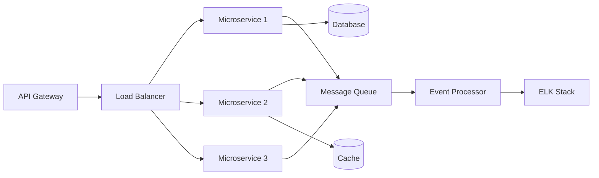

<div align="center">
  
</div>

<div align="center">
  
  [](https://git.io/typing-svg)
  
</div>

---

### 👨‍💻 **About Me**

```typescript
const goporo = {
  pronouns: "He/Him",
  currentFocus: "Backend Architecture & Distributed Systems",
  workingOn: ["Microservices", "System Design", "Cloud Infrastructure"],
  learning: [".NET Core", "Kubernetes Orchestration", "Event-Driven Architecture"],
  interests: ["Game Development", "System Design", "DevOps", "Cloud Native"],
  funFact: "I build scalable backends by day, Unity games by night 🎮",
  playMyGame: "https://simmer.io/@goporolo/planetgo"
};
```

---

### 🛠️ **Tech Stack**

<details open>
<summary><b>⚡ Backend & Languages</b></summary>
<br>


</details>

<details open>
<summary><b>🎯 Frameworks & Runtime</b></summary>
<br>


</details>

<details open>
<summary><b>🗄️ Databases & Caching</b></summary>
<br>


</details>

<details open>
<summary><b>📨 Message Queues & Event Streaming</b></summary>
<br>


</details>

<details open>
<summary><b>☁️ Cloud & DevOps</b></summary>
<br>


</details>

<details open>
<summary><b>📊 Monitoring & Logging</b></summary>
<br>


</details>

<details open>
<summary><b>🎮 Game Development</b></summary>
<br>


</details>

<details open>
<summary><b>🎨 Frontend (Secondary Skills)</b></summary>
<br>


</details>

---

### 🏗️ **Architecture & System Design**



**Core Competencies:**
- 🏛️ Microservices Architecture & Design Patterns
- 🔄 Event-Driven Architecture & CQRS
- 📡 RESTful & GraphQL API Design
- 🎯 Domain-Driven Design (DDD)
- 🔐 Authentication & Authorization (JWT, OAuth2)
- 🚀 CI/CD Pipeline Implementation
- 📈 Performance Optimization & Scalability
- 🛡️ Security Best Practices

---

### 📈 **GitHub Stats**

<div align="center">
  
  
</div>

<div align="center">
  
</div>

<div align="center">
  
</div>

---

### 🎮 **Featured Project**

<div align="center">
  
  [](https://simmer.io/@goporolo/planetgo)
  
  *Experience my Unity game creation - PlanetGo! Built with C# and Unity Engine*
  
</div>

---

### 🌐 **Connect With Me**

<div align="center">
  
[](https://linkedin.com/in/yourprofile)
[](https://twitter.com/yourhandle)
[](https://yourportfolio.com)
[](mailto:your.email@example.com)

</div>

---

### 💭 **Random Dev Quote**

<div align="center">
  


</div>

---

<div align="center">
  
### 📊 **Profile Views**


### 🏆 **GitHub Trophies**


</div>

---

<div align="center">
  
</div>

---

<div align="center">
  
**⭐️ From [GOPORO](https://github.com/GOPORO) | Building the future, one microservice at a time 🚀**

</div>
